# Senior Capstone: Phishing Email Detection System


## Overview

This project develops a machine learning system that analyzes email metadata and content to detect phishing attacks. The system extracts security-relevant features from `.eml` email files and applies multiple ML models to classify emails as either **phishing** or **legitimate**.


## Abstract
kernel-based NLP classification: Semantic-Syntactic TF-IDF N-Gram vectorization for Detection of AI-Generated Phishing Emails

Phishing attacks have increased due to AI-driven social engineering, producing deepfake emails that evade traditional lexical and rule-based detectors. These attacks pose significant threats to individuals and organizations globally by closely imitating legitimate emails, thereby complicating detection and increasing the risk of sensitive data exposure, financial loss, and identity theft. Conventional spam filters lacking grammatical or URL signatures, exposing organizations to data breaches are especially vulnerable to AI-generated deepfake emails that lack typical warning signs such as grammatical errors.
We propose a multi-classifier NLP framework extracting semantic and syntactic features via Term Frequency-Inverse Document Frequency (TF-IDF) vectorization and n-gram framework, including lexical divergence, phrase urgency, and multi-word collocations for robust phishing detection. Four models including Logistic Regression (LR), SVM-RBF, Random Forest (RF, n_estimators=100, max_depth=20), and a majority-voting ensemble method through majority voting, were hyperparameter-tuned via 5-fold cross-validation on more than 600k emails.
The Ensemble method, combining LR, SVM and RF predictions, resulted with 99.62% accuracy with 16 False positives over 5544 phishing emails. RF consistently exceeded 99.5% across different numbers of trees and depth configurations. SVM=RBF outperformed the individual performance at 99.76% accuracy with F1 score of 0.99 and an AUC-ROC of 0.999. Because of the RDF non-linear kernel, the SVM was able to handle complex phishing email patterns that linear models can't capture, the high 99.76% accuracy was also due to the  best RBF's high-dimensional TF-IDF space with local decision boundaries. The TF-IDF bigram achieved significantly higher discriminative power than unigrams alone. Unlike signature-based systems, our approach extracts semantic and syntactic features via TF-IDF vectorization and advanced n-gram analysis, enabling generalization to unseen phishing variants.
The framework demonstrates that kernel-based NLP classifiers provide scalable, real-time defense against AI-generated phishing emails, SVM-RBF 2-gram was the right tool for semantic complex text classification.


## Features
- **SOC Analyst Dashboard**: A professional Streamlit-based interface for real-time email triage.
- **MITRE ATT&CK® Mapping**: Automatically maps detected threats to specific adversarial techniques (e.g., T1036, T1566).
- **ML Ensemble Engine**: Combines TF-IDF vectorization with a high-performance ensemble model (Random Forest/XGBoost).
- **Heuristic URL Analysis**: Extracts and scores features from embedded links (TLD reputation, IP-hosting).
- **Incident Response Workflow**: Built-in actions for analysts to purge, blacklist, or flag emails for model retraining.
- Parsing and processing `.eml` email files  
- Feature extraction from email headers and body content  
- Multi-source dataset integration  
- Machine learning classification models  


## Technologies Used
- Python
- Pandas
- NumPy
- Scikit-learn
- Email parsing libraries (imaplib / email module)
- Matplotlib / Seaborn (for visualization)


## Machine Learning Models

| Model | Purpose |
|------|--------|
| Logistic Regression | Baseline linear classifier |
| SVM (LinearSVC) | High-dimensional text classification |
| Random Forest | Non-linear pattern detection |
| Naive Bayes | Fast probabilistic model |
| Ensemble Voting | Combines all models for improved accuracy |


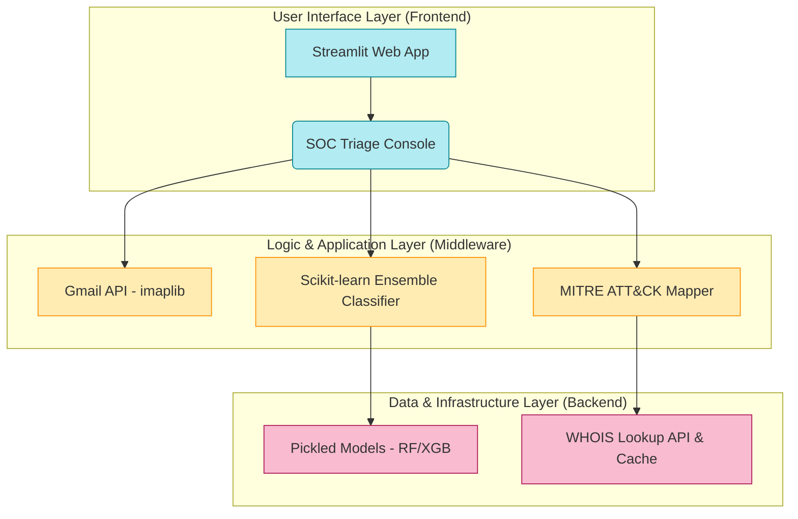


## Dataset Sources

This project uses multiple real-world phishing and legitimate email datasets:

### Enron Email Dataset (Legitimate Emails)
- Source: https://www.cs.cmu.edu/~enron/
- Kaggle Mirror: https://www.kaggle.com/datasets/wcukierski/enron-email-dataset  
- Description: Large corpus of real corporate emails used for legitimate email classification.


### Nazario Phishing Corpus
- Source: https://monkey.org/~jose/phishing/?C=N;O=D  
- Description: Early curated dataset of phishing emails used in academic research.


### Fraudulent Email Corpus
- Source: https://www.kaggle.com/datasets/rtatman/fraudulent-email-corpus  
- Description: Collection of legitimate and fraudulent emails for classification tasks.


### Phishing Email Dataset (Multi-source Kaggle dataset)
- Source: https://www.kaggle.com/datasets/naserabdullahalam/phishing-email-dataset  
- Includes:
  - CEAS_08.csv  
  - Nigerian_fraud.csv  
  - SpamAssassin.csv  
  - phishing_emails.csv  


### Phishing Website Detector Dataset
- Source: https://www.kaggle.com/datasets/eswarchandt/phishing-website-detector  
- Description: Dataset used for feature-based phishing detection (supporting feature engineering).


## Output Visualizations

After training and evaluation, the following outputs are generated:

### Confusion Matrix
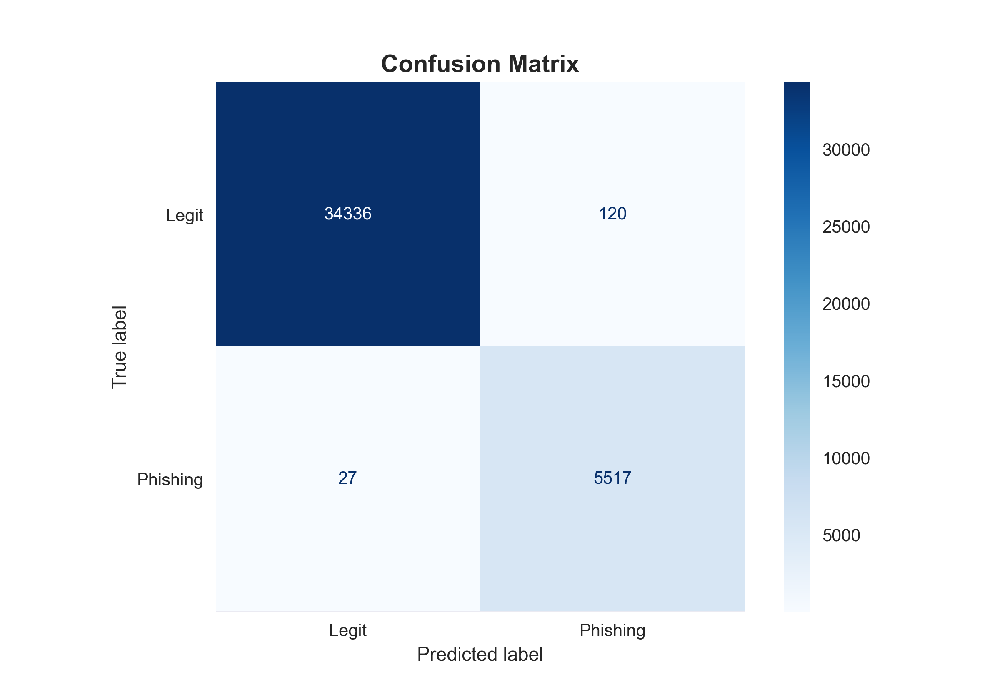

### Dataset Distribution
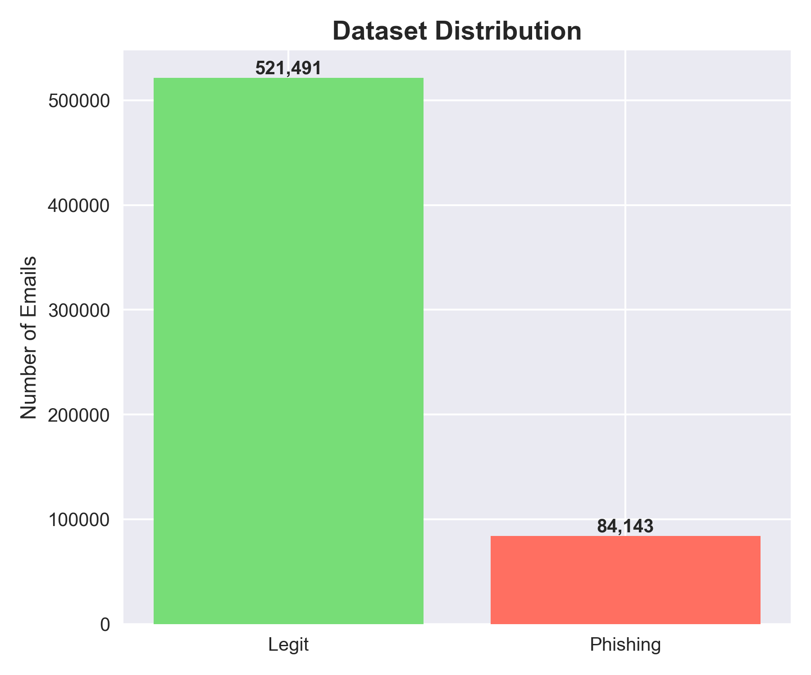

### Model Performance Comparison
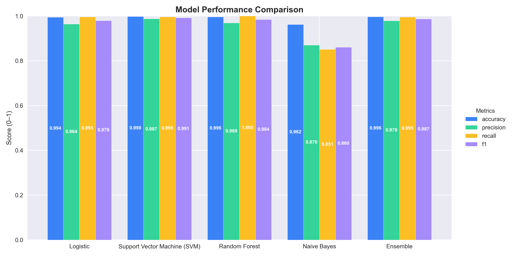

### Random Forest Experiments
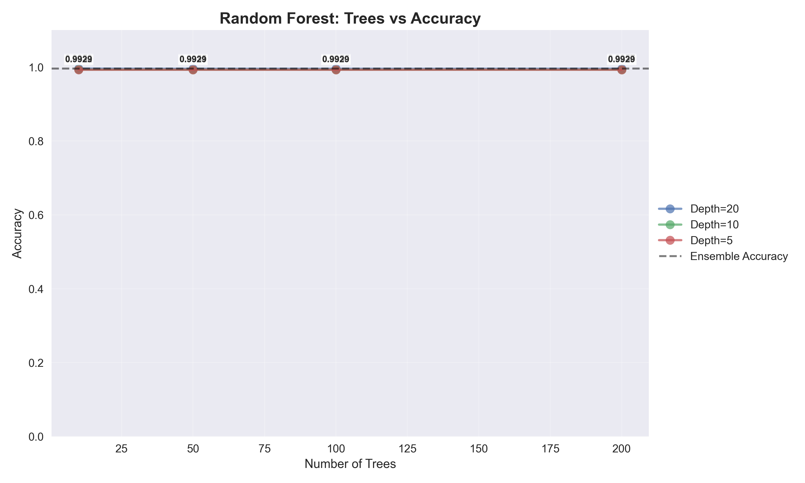
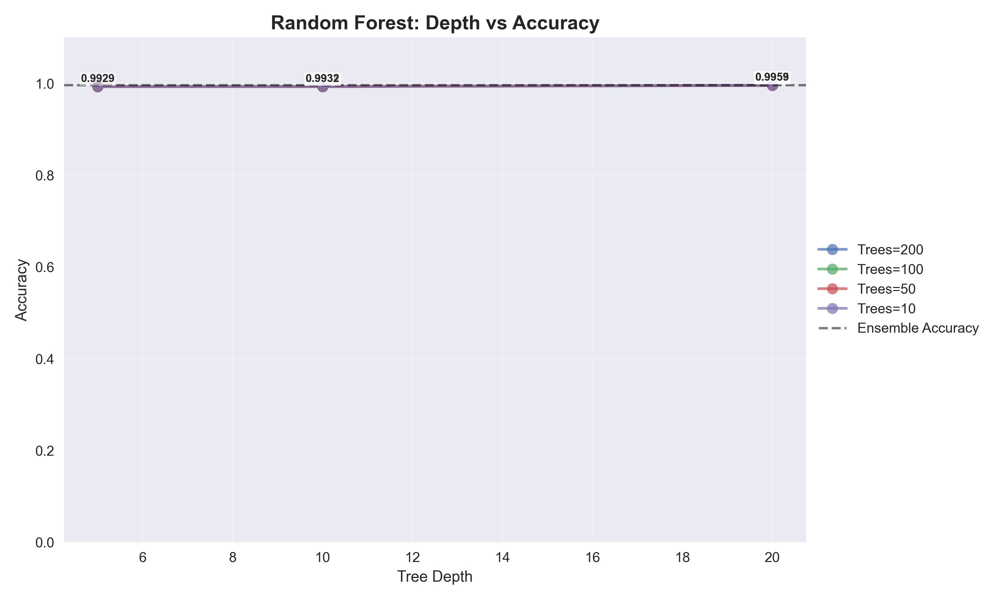

### Accuracy Comparison
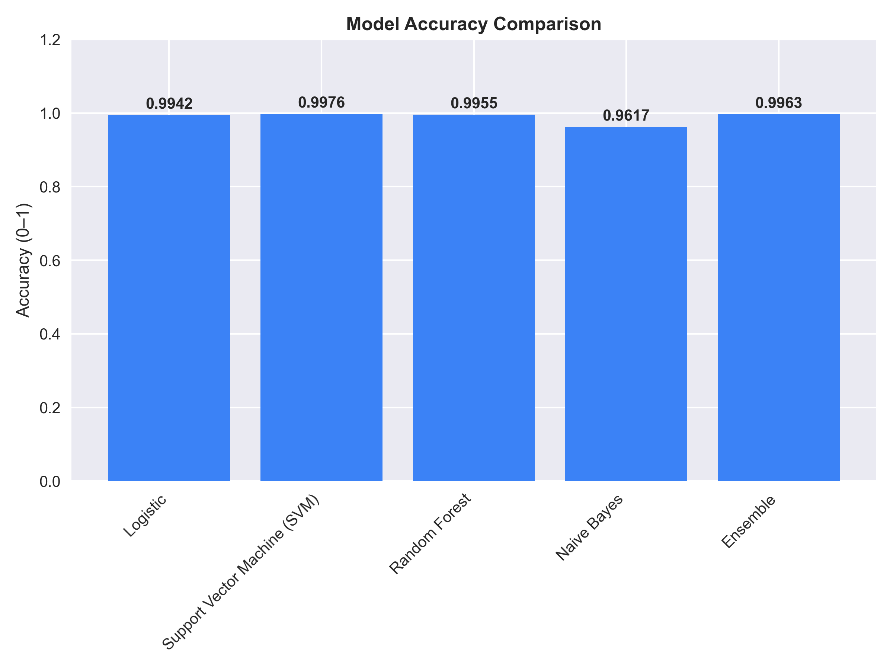

### Feature Importance
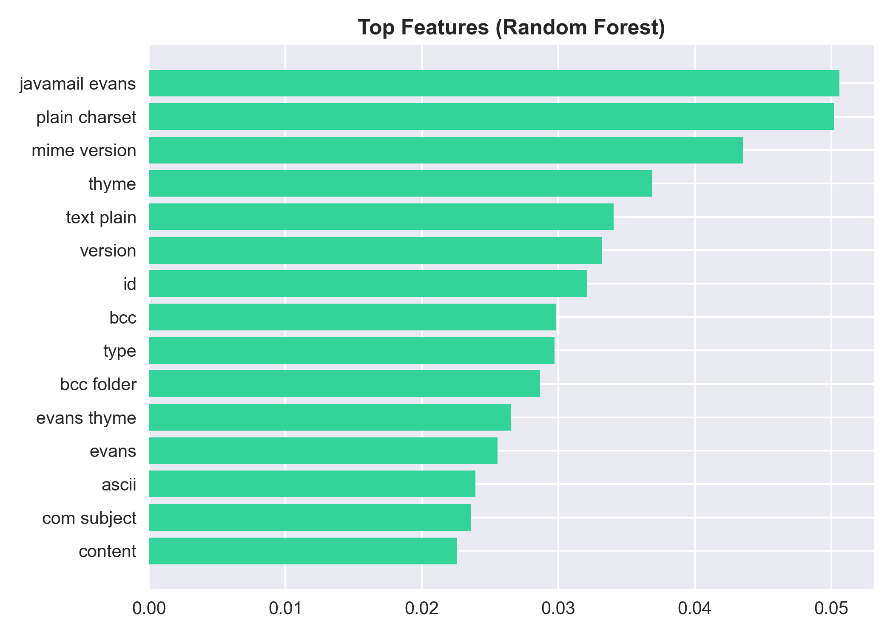

### Correlation Matrix
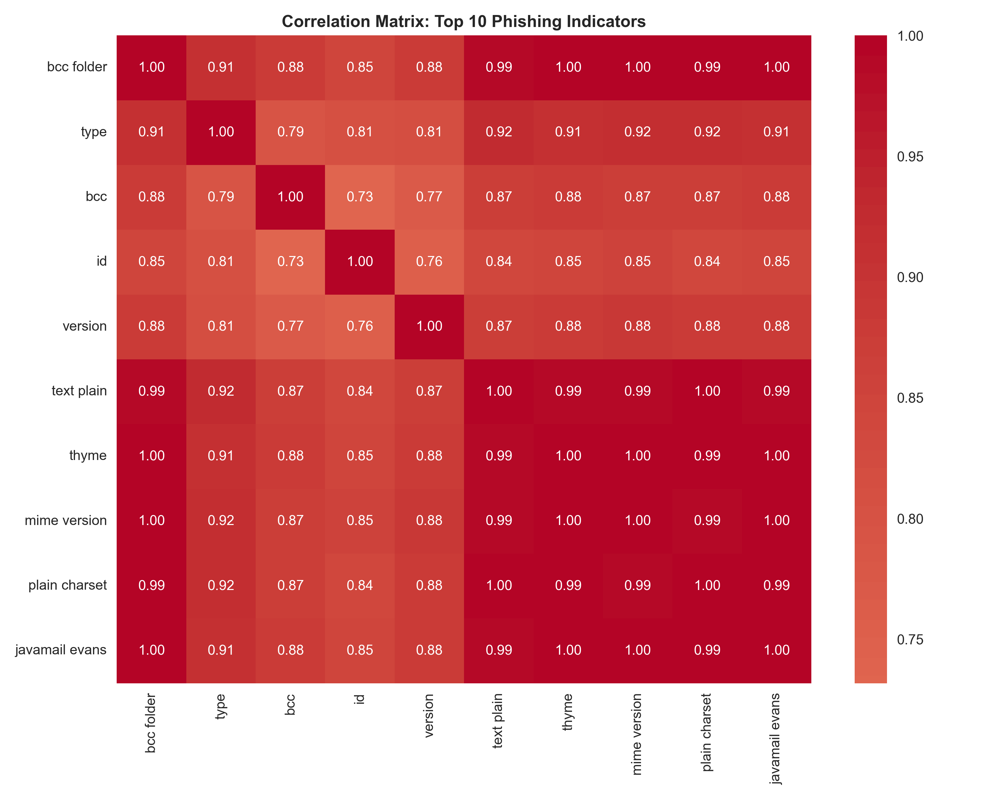

### Logistic Regression Optimizers
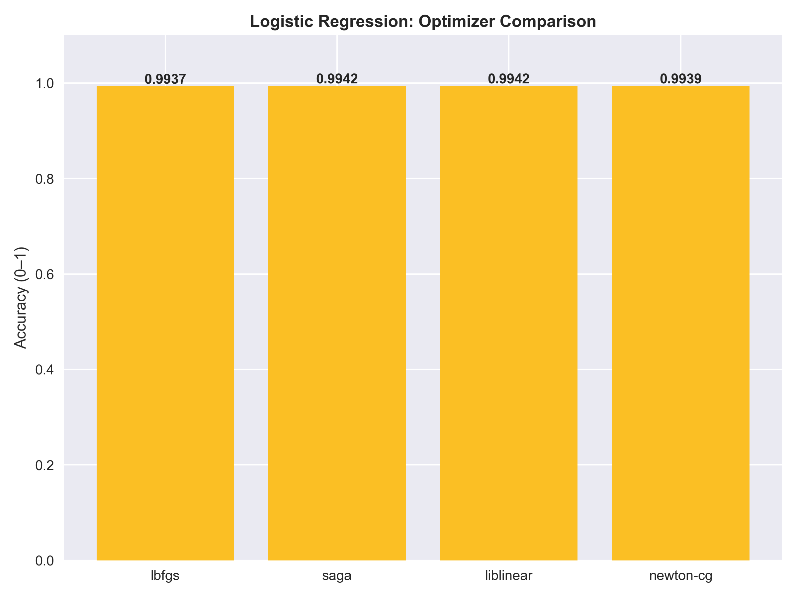


## ▶ How to Run

### 1. Prerequisites & Installation
Ensure you have Python 3.10+ installed.
```bash
pip install -r requirements.txt
```

### 2. Launch the SOC Dashboard (GUI)
The primary interface for security analysts to scan Gmail inboxes and analyze threats.
```bash
streamlit run src/deployment/streamlit_app.py
```

### 3. Run the CLI Tool
Analyze local .eml files directly from your terminal without a browser.
```bash
# Analyze a single email file
python src/deployment/detect_email.py --file samples/suspicious_email.eml

# Analyze a directory of emails
python src/deployment/detect_email.py --dir samples/inbox_dump/
```

## SOC Analyst Workflow & Threat Modeling

This system transforms raw data into actionable intelligence by mapping detections to the **MITRE ATT&CK® Framework**.

### Automated Threat Analysis
| Technique | Component | Friendly Description |
| :--- | :--- | :--- |
| **T1036** | **Identity Deception** | Detection of display name spoofing and domain age anomalies. |
| **T1566.002** | **Malicious Link** | Heuristic URL analysis identifying suspicious TLDs and IP-based hosting. |
| **T1204.001** | **Urgency Tactics** | NLP detection of high-pressure language used to elicit user action. |


### SOC Dashboard Logic & Implementation

I designed the SOC Console as a practical tool for security analysis or to be used as a Security Operations Center (SOC) tool. The goal was to bridge the gap between complex machine learning and use real-world data to show the model handles real life threats.

1. Real-time Data Ingestion
The dashboard uses the **imaplib** libraryand **OAuth 2.0** to securely connect to my Gmail accoumt. It fetches raw email content and parses out the headers and body. Building this connection wasimportant because it allowed me to test how the model handels real-world formatting, tracking pixels, and complex HTML that are not always found in cleaned data sets.

2. Multi-Layered Analysis Pipeline
Every email that comes through goes through three specific checkpoints before it is labeled as **phishing** or **legitimate**:
- NLP Text Analysis: I ussed a TF-IDF Vectorizer with N-Grams (Bigrams) to look for phrase patterns. By focusing on word collocations like "Action Required" or "Account Suspension", the model can detct the urgency and pressure commonly found in AI-generated social engineering.
- Domain Reputation (Tranco Integration): To minimize false positives, I integrated the Tranco top-50k reputable domains dataset. If an email comes from a trusted domain or a verified sender and passes SPF/DKIN/DMARC checks, the system gives it a trust bonus to keep it out of the 
- URL & Cloud Analysis: The system retreives every link the email and checks them against the VirusTotal API for known malware, but it also flags links hosted on clous services like Google Storage or Azure Blobs. Attackers often hide phishing pages on Google Storage or Azure Blobs because these domains already have a good reputation.

3. Balanced Scoring
One challenge I experiences was ensuring the legitimate marketing were not flagged as phishing because of its language. I was able to solve this issue by using this approach.
If the domain is highly reputable (verified via Tranco), the system prioritizes the verified identity over the suspicious language.
If the sender is unknown or fails identity checks, the system "boosts" the importance of the text analysis. In these cases, if the language looks even slightly suspicious, it gets pushed into the HIGH or CRITICAL severity tier.

4. MITRE ATT&CK Mapping


### Gmail Inbox Folder Analysis
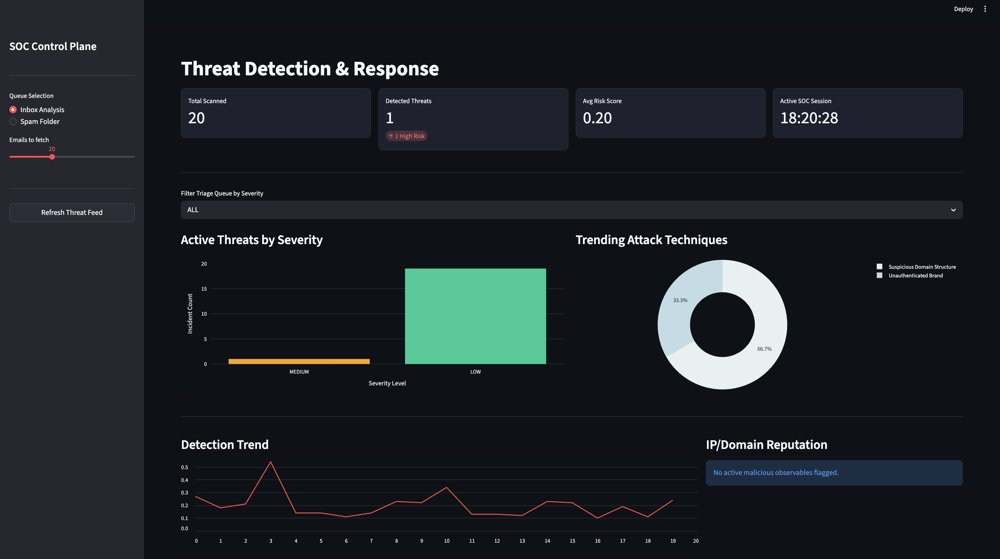
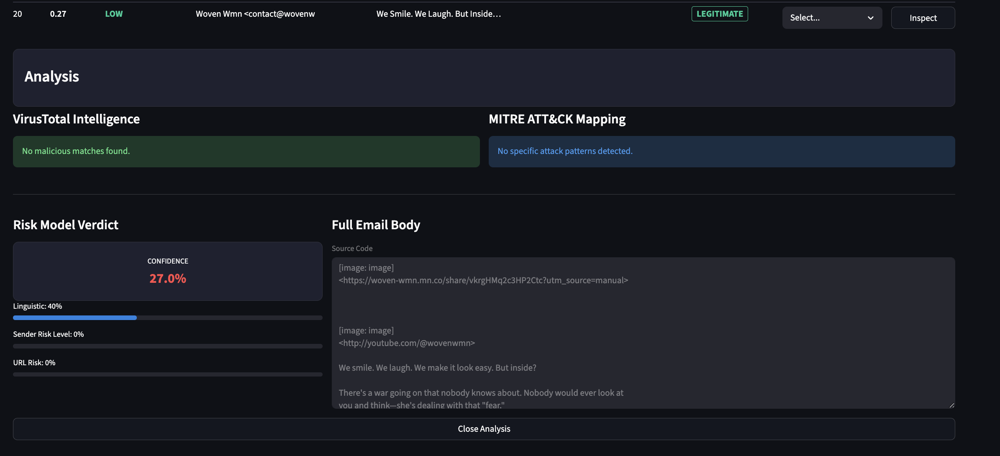
### Gmail Spam Folder Analysis
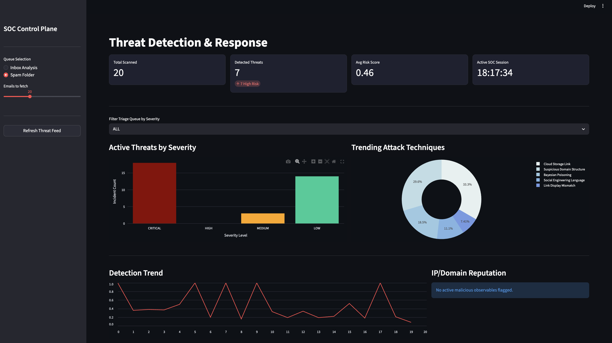
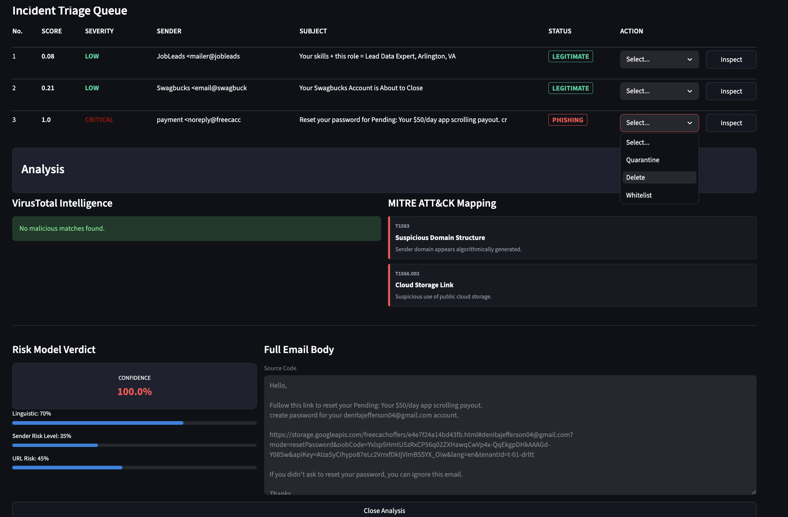


