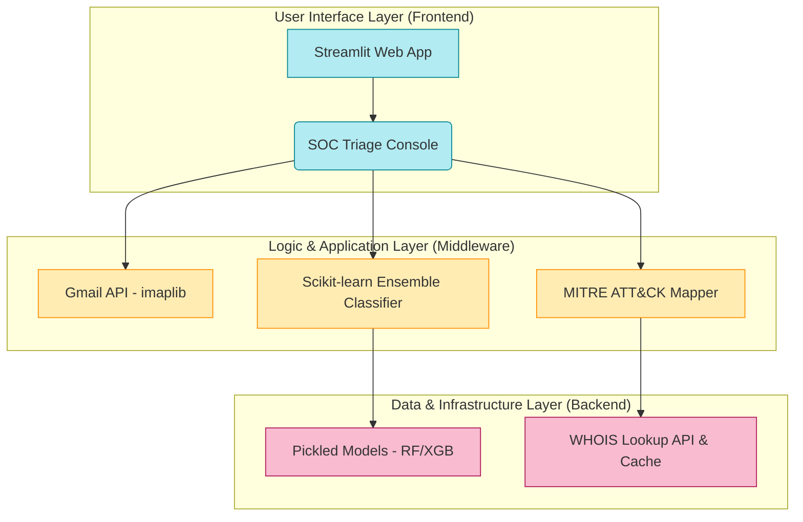

# Senior Capstone: Phishing Email Detection System


## Overview

This project develops a machine learning system that analyzes email metadata and content to detect phishing attacks. The system extracts security-relevant features from `.eml` email files and applies multiple ML models to classify emails as either **phishing** or **legitimate**.


## Abstract
In recent years, phishing attacks have become increasingly sophisticated due to advances in artificial intelligence and social engineering, posing significant risks to individuals and organizations worldwide. These attacks often mimic legitimate emails, making them difficult to detect and increasing the risk of compromised sensitive information, financial losses, and identity theft. Existing phishing detection solutions, such as rule-based filters and traditional spam detectors, often fail to adapt to evolving threats, particularly AI-generated “deepfake” emails that lack common warning signs such as grammatical errors.

This project addresses the growing challenge of accurately identifying phishing emails by developing an intelligent detection system that leverages machine learning and natural language processing (NLP) and adapts to new and emerging threats over time.
Experimental results demonstrate that the proposed model achieves high classification accuracy and effectively distinguishes between phishing and legitimate emails, fostering confidence in its reliability.

The findings suggest that AI-driven phishing detection systems can significantly reduce users' susceptibility to cyberattacks by providing timely, accurate alerts. This work contributes to the field of cybersecurity by addressing limitations in traditional detection methods and offering a scalable, adaptable solution. Ultimately, this project highlights the importance of integrating intelligent security tools to enhance digital safety in an increasingly threat-prone environment.


## Features
- **SOC Analyst Dashboard**: A professional Streamlit-based interface for real-time email triage.
- **MITRE ATT&CK® Mapping**: Automatically maps detected threats to specific adversarial techniques (e.g., T1036, T1566).
- **ML Ensemble Engine**: Combines TF-IDF vectorization with a high-performance ensemble model (Random Forest/XGBoost).
- **Heuristic URL Analysis**: Extracts and scores features from embedded links (TLD reputation, IP-hosting).
- **Incident Response Workflow**: Built-in actions for analysts to purge, blacklist, or flag emails for model retraining.
- Parsing and processing `.eml` email files  
- Feature extraction from email headers and body content  
- Multi-source dataset integration  
- Machine learning classification models  


## Technologies Used
- Python
- Pandas
- NumPy
- Scikit-learn
- Email parsing libraries (imaplib / email module)
- Matplotlib / Seaborn (for visualization)

## SOC Analyst Workflow & Threat Modeling

This system transforms raw data into actionable intelligence by mapping detections to the **MITRE ATT&CK® Framework**.

### Automated Threat Analysis
| Technique | Component | Friendly Description |
| :--- | :--- | :--- |
| **T1036** | **Identity Deception** | Detection of display name spoofing and domain age anomalies. |
| **T1566.002** | **Malicious Link** | Heuristic URL analysis identifying suspicious TLDs and IP-based hosting. |
| **T1204.001** | **Urgency Tactics** | NLP detection of high-pressure language used to elicit user action. |


## Machine Learning Models

| Model | Purpose |
|------|--------|
| Logistic Regression | Baseline linear classifier |
| SVM (LinearSVC) | High-dimensional text classification |
| Random Forest | Non-linear pattern detection |
| Naive Bayes | Fast probabilistic model |
| Ensemble Voting | Combines all models for improved accuracy |





## Dataset Sources

This project uses multiple real-world phishing and legitimate email datasets:

### Enron Email Dataset (Legitimate Emails)
- Source: https://www.cs.cmu.edu/~enron/
- Kaggle Mirror: https://www.kaggle.com/datasets/wcukierski/enron-email-dataset  
- Description: Large corpus of real corporate emails used for legitimate email classification.


### Nazario Phishing Corpus
- Source: https://monkey.org/~jose/phishing/?C=N;O=D  
- Description: Early curated dataset of phishing emails used in academic research.


### Fraudulent Email Corpus
- Source: https://www.kaggle.com/datasets/rtatman/fraudulent-email-corpus  
- Description: Collection of legitimate and fraudulent emails for classification tasks.


### Phishing Email Dataset (Multi-source Kaggle dataset)
- Source: https://www.kaggle.com/datasets/naserabdullahalam/phishing-email-dataset  
- Includes:
  - CEAS_08.csv  
  - Nigerian_fraud.csv  
  - SpamAssassin.csv  
  - phishing_emails.csv  


### Phishing Website Detector Dataset
- Source: https://www.kaggle.com/datasets/eswarchandt/phishing-website-detector  
- Description: Dataset used for feature-based phishing detection (supporting feature engineering).


## Output Visualizations

After training and evaluation, the following outputs are generated:

### Confusion Matrix


### Dataset Distribution


### Model Performance Comparison


### Random Forest Experiments


### Accuracy Comparison


### Feature Importance


### Correlation Matrix


### Logistic Regression Optimizers


## ▶ How to Run

### 1. Prerequisites & Installation
Ensure you have Python 3.10+ installed.
```bash
pip install -r requirements.txt
```

### 2. Launch the SOC Dashboard (GUI)
The primary interface for security analysts to scan Gmail inboxes and analyze threats.
```bash
streamlit run src/deployment/streamlit_app.py
```

### 3. Run the CLI Tool
Analyze local .eml files directly from your terminal without a browser.
```bash
# Analyze a single email file
python src/deployment/detect_email.py --file samples/suspicious_email.eml

# Analyze a directory of emails
python src/deployment/detect_email.py --dir samples/inbox_dump/
```


